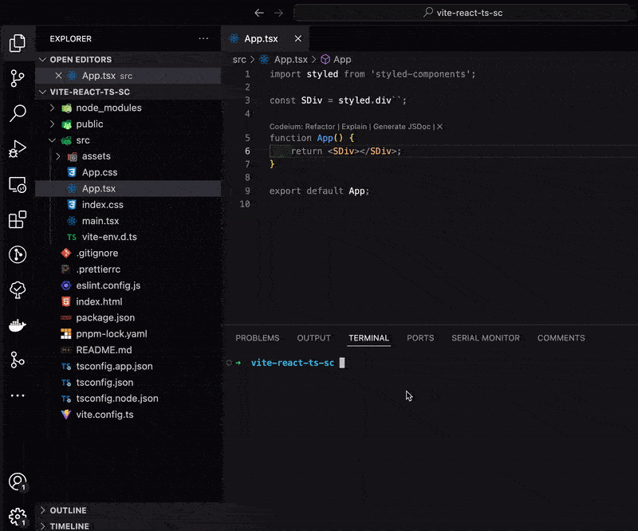

# lootui

Using the CLI, you can copy @lootui components. They usually come with a few options (TS+Styled Components/TS+SCSS modules) that you can choose from to best suit your needs. The components are fully accessible and, as they are your own, you can modify them however you want.

## Usage

`npx lootui <package name>`

## Examples

